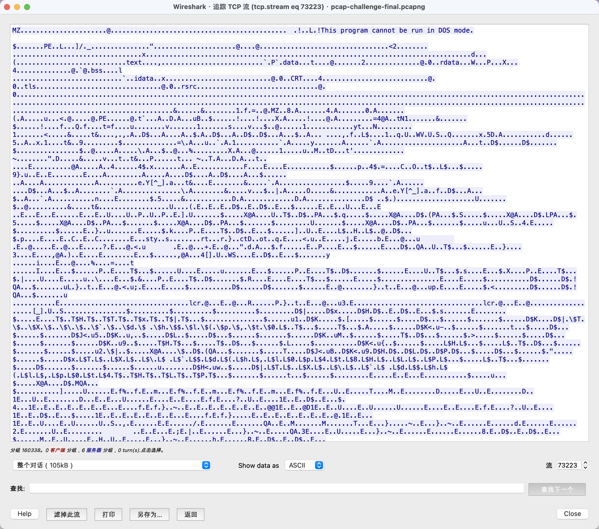

# The SUM of All FEARS

*After hacking a victim's computer, Luciafer downloaded several files, including two binaries with identical names, but with the extensions .exe and .bin (a Windows binary and a Linux binary, respectively).*

*What are the MD5 hashes of the two tool programs? Submit both hashes as the flag, separated by a |: flag{ExeMD5|BinMD5}*

*Use the PCAP from LYTTON LABS 01 - Monstrum ex Machina.*

---

Luciafer下载了两个具有相同名称的二进制文件(分别以.exe和.bin结尾),两个文件的md5值拼接后即为flag

使用[Wireshark](https://www.wireshark.org/download.html)分析`pcap-challenge-final.pcapng`文件,发现是下载了`lytton-crypt.exe`和`lytton-crypt.bin`两个文件

选中一个接收`lytton-crypt.exe`文件的数据包,右键点击“跟踪流”->"TCP流"


然后点击“另存为”,保存为`lytton-crypt.exe`



重复上述步骤,得到`lytton-crypt.bin`.然后计算两个文件的md5值

```shell
╭─ ~/CTF/DEADFACE
╰─$ md5 lytton-crypt.*
MD5 (lytton-crypt.bin) = 4da8e81ee5b08777871e347a6b296953
MD5 (lytton-crypt.exe) = 9cb9b11484369b95ce35904c691a5b28
```

**flag:**`flag{9cb9b11484369b95ce35904c691a5b28|4da8e81ee5b08777871e347a6b296953}`


